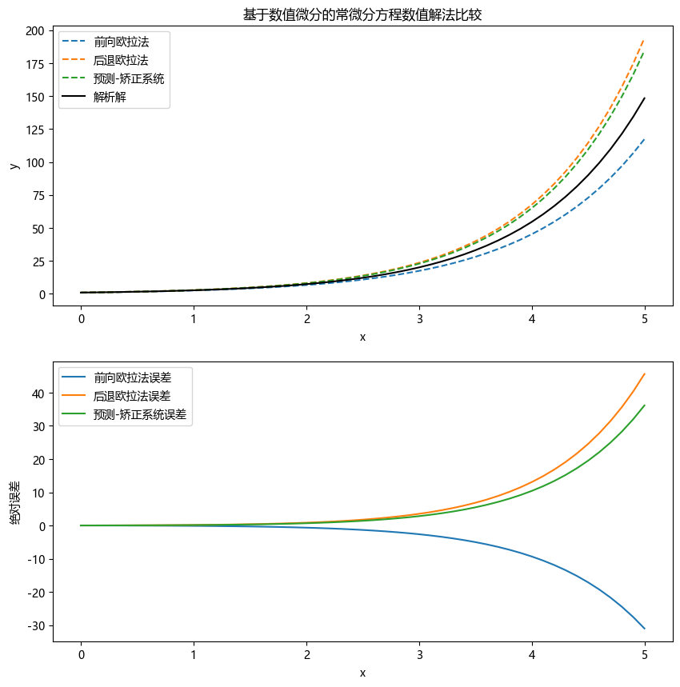
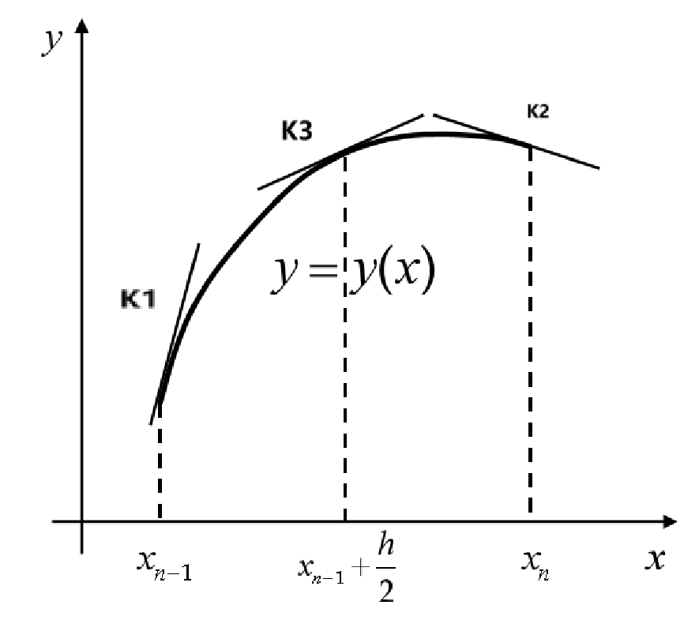
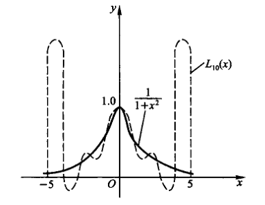
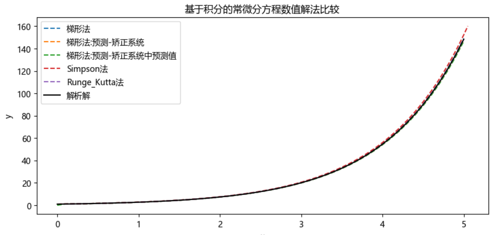
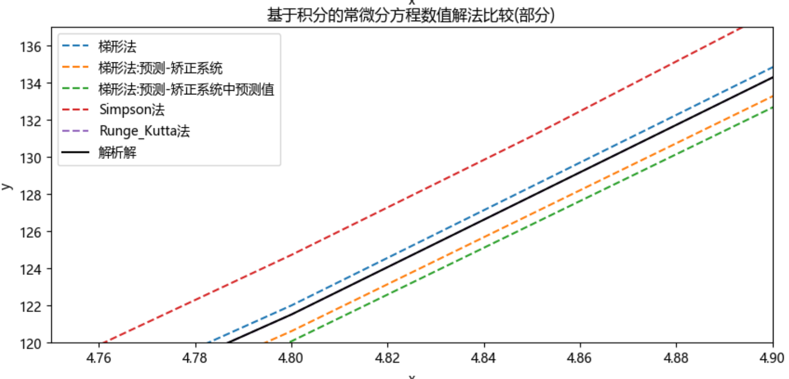
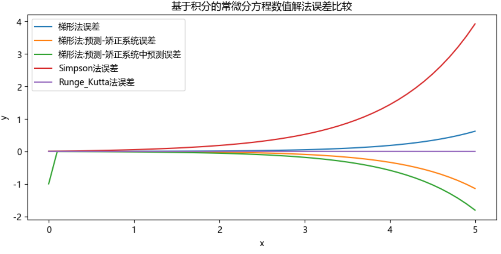
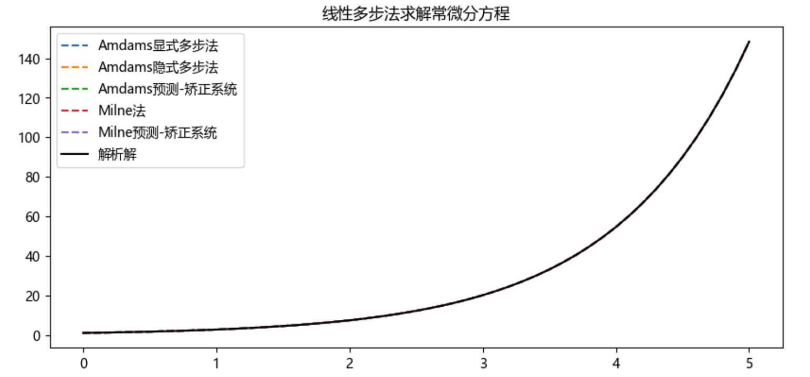
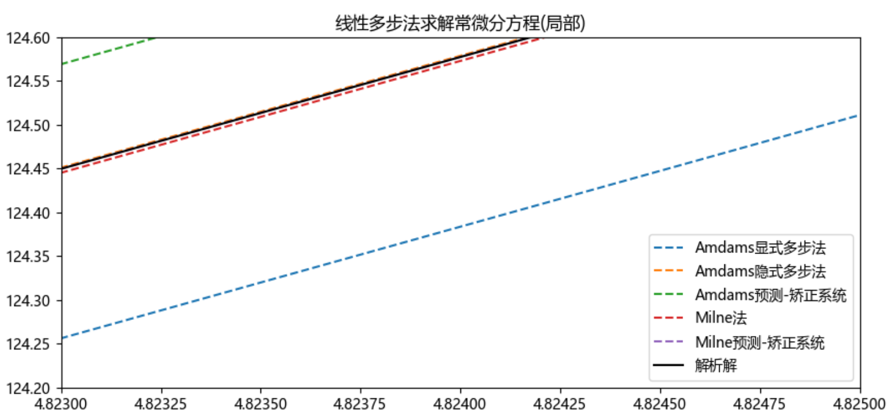
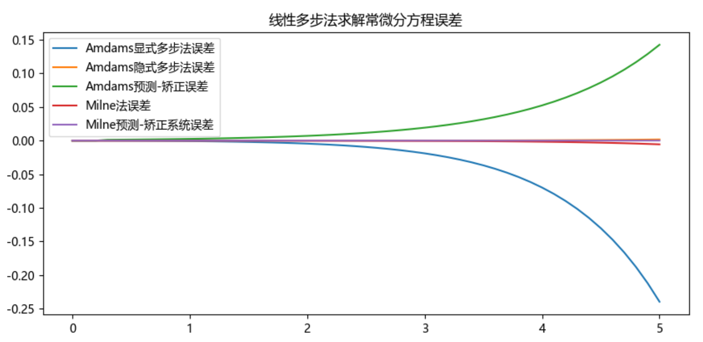

<!--

Created: Sun Jun 02 2024 20:17:36 GMT+0800 (中国标准时间)

Modified: Sun Jun 02 2024 20:17:36 GMT+0800 (中国标准时间)

-->

  
  

# 计算机数值方法期末作业

<a id="markdown-计算机数值方法期末作业" name="计算机数值方法期末作业"></a>

***

<!-- TOC -->

  

- [计算机数值方法期末作业](#计算机数值方法期末作业)

  - [1. 引言](#1-引言)

    - [1.1. 常微分方程](#11-常微分方程)

    - [1.2. 数值解](#12-数值解)

    - [1.3. 离散化](#13-离散化)

    - [1.4. 误差](#14-误差)

  - [2. 基于微分的数值解法](#2-基于微分的数值解法)

    - [2.1. 前向欧拉法](#21-前向欧拉法)

    - [2.2. 后退欧拉法](#22-后退欧拉法)

    - [2.3. 预测-矫正系统](#23-预测-矫正系统)

    - [2.4. 基于微分的数值求解方法的实验结果](#24-基于微分的数值求解方法的实验结果)

  - [3. 基于积分的数值求解](#3-基于积分的数值求解)

    - [3.1. 梯型公式](#31-梯型公式)

    - [3.2. 改进欧拉法](#32-改进欧拉法)

    - [3.3. Simpson法](#33-simpson法)

    - [3.4. Runge-Kutta法](#34-runge-kutta法)

      - [3.4.1. 三阶runge法](#341-三阶runge法)

      - [3.4.2. 更高阶的Runge-Kutta法](#342-更高阶的runge-kutta法)

    - [3.5. 基于积分的数值求解方法的实验结果](#35-基于积分的数值求解方法的实验结果)

  - [4. 线性多步法](#4-线性多步法)

    - [4.1. 开型求解](#41-开型求解)

      - [4.1.1. Amdms显式求解公式](#411-amdms显式求解公式)

      - [4.1.2. Adams隐式求解公式](#412-adams隐式求解公式)

    - [4.2. 闭型求解](#42-闭型求解)

      - [4.2.1. Milne求解公式](#421-milne求解公式)

      - [4.2.2. Milne预测-矫正系统](#422-milne预测-矫正系统)

    - [4.3. 线性多步法的实验结果](#43-线性多步法的实验结果)

  

<!-- /TOC -->

***

  

## 1. 引言

<a id="markdown-引言" name="引言"></a>

  

本文是计算机数值方法期末作业，主要讨论常微分方程的数值解。常微分方程的数值解是指通过数值方法求解微分方程的近似解。本文主要讨论了常微分方程的数值解的一些基本方法，包括前向/后退欧拉(矩形法)法、龙格库塔法，线性多步法等，并通过实例进行了说明。本文在示例时使用的微分方程是

$$

y'=y,y(0)=1

$$

其解析解为 $y=e^x$。

后续实验会考虑其他微分方程。

  

### 1.1. 常微分方程

<a id="markdown-常微分方程" name="常微分方程"></a>

  

对于<a name='常微分方程'>常微分方程</a>:

  
  

$$\begin{cases}

y'=f(x, y), a⩽ x⩽ b, &(1.1)\\

y(a)=y_0&(1.2)

\end{cases}$$

  

与$(1.1)，(1, 2)$等价的积分方程:

  

$$y(x)=y_0+\int_{a}^{x}f(t, y(t))dt \qquad(1.3)$$

<a name='1.3'></a>

其中，$y(x)$是方程$(1.1)$的解，$y_0$是初值。

  

如果$f(x, y)$在矩形区域$R=\{(x, y)|a⩽ x⩽ b, |y-y_0|⩽ \alpha\}$上连续且满足利普希茨条件，即存在常数$L>0$，使得

  

$$

|f(x, y_1)-f(x, y_2)|⩽ L|y_1-y_2|, \quad∀(x, y_1), (x, y_2)∈R

$$

  

则方程$(1.1)$的解$y(x)$在区间$[a, b]$上存在且唯一。

  

### 1.2. 数值解

<a id="markdown-数值解" name="数值解"></a>

  

所谓解常微分方程的数值方法，就是求$y(x)$在区间$[a，b]$中一系列离散点(也称节点)

  

$$

a=x_0<x_1<⋯<x_n=b

$$

  

上的近似值$y_0, y_1, ⋯, y_n$，使得$y_i$是$y(x_i)$的近似值。这些近似值可以通过数值方法计算得到。将求解(1.1)、(1.2)的问题变为计算(1.1)、(1.2)在节点上的近似值问题，就是将数学问题转化成数值问题．**由求解公式计算$y(x)$的近似值$y(k=1，2，...，n)$的方法就称数值方法**，由数值方法计算得到的 y，统称为计算解，也就是数值解．

  

从带有初值问题常微分方程的形式可以看出，求解数值解的关键在于$y'(x)$和$\int_{a}^{x}f(t, y(t))\mathrm{dt}$的数值计算问题。具体来说，我们已知了$y(a)=y_0$, 则可以从该点出发，先求出$y_1$，在根据$y_0, y_1$求出$y_2$.... 以此类推，直到求出$y_n$。这样就得到了$y(x)$在区间$[a, b]$上的近似值$y_0, y_1, ⋯, y_n$。

  

- 如果我们在求解$y_k$时只用到了$y_{k-1}$，则称该方法为单步法

- 如果在求解$y_k$时用到了$y_{k-1}, y_{k-2}, ⋯, y_{k-m}$，则称该方法为多步法。

  

从后续的实验结果来看，单步法的精度相较于多步法(线性多步法)的精度低，但是计算时间更快。

  

### 1.3. 离散化

<a id="markdown-离散化" name="离散化"></a>

  

用数值方法求解常微分方程时，往往采用等分区间取节点的方法对数学问题进行数值化（即离散化），即将求解区间$[a，b]$分成 n 等份，令

  

$$

h=\frac{b-a}{n}\qquad x_i=a+ih\qquad i=0, 1, 2, ..., n

$$

  

其中，$h$为步长，$x_i$为节点，$n$为节点数。这样，求解常

微分方程的问题就变成了求解常微分方程在节点上的近似值问题。

  

### 1.4. 误差

<a id="markdown-误差" name="误差"></a>

衡量求解公式好坏的一个主要标准是求解公式的精度，即解的精确值$y(x)$与计算值$y$之差

$$

e_j(h)=y(x_j)-y_j

$$

该插值成为截断误差，如果是采用步进的方式求解，则是第$j$步的截断误差。

  

若

$$

e_j(h)=O(h^{p+1}) \qquad (1.4.1)

$$

则称**该数值方法是$p$阶精度的**。通常情况下，$p$越大，精度越高，但是计算量也越大。

***

  

## 2. 基于微分的数值解法

<a id="markdown-基于微分的数值解法" name="基于微分的数值解法"></a>

  

### 2.1. 前向欧拉法

<a id="markdown-前向欧拉法" name="前向欧拉法"></a>

  

对于初值问题$(1.1), (1.2)$，在区间$[x_k, x_{k+1}]$上，使用两点数值微分公式:

  

$$

\begin{aligned}

    [a,x_{1}]:\frac{1}{h}(y_{1}-y_{0})&=y^{\prime}(a)+\frac{h}{2}y^{\prime\prime}(\eta_{0})\\&=y^{\prime}(x_{1})-\frac{h}{2}y^{\prime\prime}(\xi_{0})\\

    [x_{1},x_{2}]:\frac{1}{h}(y_{1}-y_{0})&=y^{\prime}(x_1)+\frac{h}{2}y^{\prime\prime}(\eta_{1})\\&=y^{\prime}(x_{2})-\frac{h}{2}y^{\prime\prime}(\xi_{1})\\

    ....................\\

    [x_{j},x_{2}]:\frac{1}{h}(y_{j}-y_{0})&=y^{\prime}(x_j)+\frac{h}{2}y^{\prime\prime}(\eta_{j})\\&=y^{\prime}(x_{j+1})-\frac{h}{2}y^{\prime\prime}(\xi_{j})\\

    ....................

\end{aligned}

$$

其中$y_j=y(x_j)，j=2,3,...,n-1$，把$y'=f(x,y)$带入，得到

$$

\begin{aligned}

\frac{1}{h}(y_{j+1}-y_{j})&=y^{\prime}(x_{j})+\frac{h}{2}y^{\prime\prime}(\eta_{j})\\&=f(x_{j},y_{j})+\frac{h}{2}f^{\prime}(x_{j},y_{j})\\&=f(x_j,y_j)+\frac{h}{2}y''(\eta_j)

\end{aligned}

$$

其中$\eta_j$在$x_j$和$x_{j+1}$之间，所以有

$$

y_{j+1}=y_j+hf(x_j,y_j)+\frac{h^2}{2}y''(\eta_j)

$$

令

$$

\begin{cases}

    \bar{y}_{j+1}=y_j+hf(x_j,y_j)\\

    e_{j+1}(h)=\frac{h^2}{2}y''(\eta_j)

\end{cases}

$$

其中$\bar{y}_{j+1}$是$y_{j+1}$的近似值，$e_{j+1}$是截断误差。$h$比较小时，可以用$x_j$代替$\eta_j$，并且无误差也会变小，则可以用$\bar{y_j}$近似代替$y_j,$因此有

$$

\begin{cases}

    y_{j+1}=y_j+hf(x_j,y_j)\\

    e_{j+1}(h)=\frac{h^2}{2}y''(\eta_j)\approx\frac{h^2}{2}y''(x_j)

\end{cases}

\qquad (2.1.1)

$$

该式即为<a name='前向欧拉法'>前向欧拉法</a>的迭代公式及其误差。

  

显然

$$

e_j(h)=\frac{h^2}{2}y''(x_j)=O(h^2)，\quad j=0,1,2,...,n-1

$$

因此**前向欧拉法是一阶精度的。**

  

实现代码

```python

## 基于微分方程的数值求解方法

### 前向欧拉法

def forward_euler(f, y0, x0, x_end, h):

    """

    前向欧拉法求解常微分方程

    Params:

        f: 函数 f(x, y)，表示微分方程 y' = f(x, y)

        y0: 初始条件 y(t0) = y0

        t0: 初始条件

        x_end: 终止点

        h: 步长

    Return:

        x: 自变量数组

        y: 数值解数组

    """

    x = np.arange(x0, x_end + h, h)

    y = np.zeros(len(x))

    y[0] = y0

  

    for i in range(1, len(x)):

        # 前向欧拉法公式

        y[i] = y[i-1] + h * f(x[i-1], y[i-1])

  

    return x, y

```

  

### 2.2. 后退欧拉法

<a id="markdown-后退欧拉法" name="后退欧拉法"></a>

如果讲$y'=f(x,y)$带入两点微分公式的第二个等式，经过相同的化简和近似代替，得到后退欧拉法的迭代公式及其误差

$$

\begin{cases}

    y_{j+1}=y_j+hf(x_{j+1},y_{j+1})\\

    e_{j+1}(h)=\frac{h^2}{2}y''(\eta_j)\approx\frac{h^2}{2}y''(x_j)

\end{cases}

\qquad (2.2.1)

$$

  

可以看到，<a name='后退欧拉公式'>后退欧拉公式</a>中等式左右两边都有$y_{j+1}$,因此这是一个隐式方程，可以采用迭代法(例如牛顿法，牛顿下山法，二分法)求解。

  

本文中并不涉及到方程求解的问题，因此直接调用 **scipy** 库中的 **fsolve** 函数求解。具体来说，我们把$y_{j+1}$看作未知数，将等式一边化为0，得到一个方程，例如

$$

 y_{j+1}-y_j-hf(x_{j+1},y_{j+1})=0

$$然后调用**fsolve**函数求解该方程，得到$y_{j+1}$

  

由于误差分析与前向欧拉法相同，因此**后退欧拉法也是一阶精度的。**

```python

# 后退欧拉法

from scipy.optimize import fsolve

def backward_euler(f, y0, x0, x_end, h):

    """

    后退欧拉法求解常微分方程

    Params:

        f: 函数 f(x, y)，表示微分方程 y' = f(x, y)

        y0: 初始条件 y(x0) = y0

        x0: 初始点x0

        x_end: 终止点

        h: 步长

    Return:

        x: 自变量数组

        y: 数值解数组

    """

    x = np.arange(x0, x_end + h, h)

    y = np.zeros(len(x))

    y[0] = y0

  

    for i in range(1, len(x)):

        # 定义隐式方程

        g = lambda yi: yi - y[i-1] - h * f(x[i], yi)

        # 求解 g(yi) = 0

        y[i] = fsolve(g, y[i-1])

    return x, y

```

  

### 2.3. 预测-矫正系统

<a id="markdown-预测-矫正系统" name="预测-矫正系统"></a>

由于后退欧拉法需要求解隐式方程，因此计算量较大，并且在实验中发现，后退欧拉法和前向欧拉法的误差往往是分布在0的两侧，也就是说后退欧拉法预测偏大(偏小)，前向欧拉法预测偏小(偏大)。因此为了减少计算量，并且综合二者的预测结果，提高精度，可以采用预测-矫正系统。

  

预测-矫正系统的基本思想是，先用前向欧拉法预测$y_{j+1}$的值，然后用该值作为后退欧拉法的初始值，求解$y_{j+1}$。这样，可以减少计算量，提高计算效率。

$$

\begin{cases}

\bar{y}_{k}=y_{k-1}+hf(x_{k-1},y_{k-1})&\text{预测值}\\y_{k}=y_{k-1}+hf(x_{k},\bar{y}_{k}),&\text{校正值}\\y(x_{0})=y_{0},k=1,2,\cdots.\end{cases}

\qquad (2.3.1)

$$

这种方法通过循环的预测-矫正，充分利用两种线性单步法的优点，提高了数值解的精度，其求解过程是:

$y_{0}\to(\bar{y}_{1})\to y_{1}\to(\bar{y}_{2})\to y_{2}\to\cdots\to(\bar{y}_{n})\to y_{n}$

```python

### 预测-校正方法

def euler_predict_correct(f, y0, x0, x_end, h):

    """

    预测-校正方法求解常微分方程

    Params:

        f: 函数 f(x, y)，表示微分方程 y' = f(x, y)

        y0: 初始条件 y(x0) = y0

        x0: 初始点

        x_end: 终止点

        h: 步长

    Return:

        x: 自变量数组

        y: 数值解数组

    """

    x = np.arange(x0, x_end + h, h)

    y = np.zeros(len(x))

    y[0] = y0

    for i in range(1, len(x)):

        # 使用前向欧拉法进行预测

        y_predict = y[i-1] + h * f(x[i-1], y[i-1])

        # 使用后退欧拉法进行校正

        y[i] = y[i-1] + h* f(x[i], y_predict)

    return x, y

```

  

### 2.4. 基于微分的数值求解方法的实验结果

<a id="markdown-基于微分的数值求解方法的实验结果" name="基于微分的数值求解方法的实验结果"></a>

实验配置

```python

# 测试数据

def f(x, y):

    # 微分方程:y'=y

    # 解析解:y=exp(x)

    return y

y0 = 1 # 初始条件y(0)=1

x0 = 0  # 初始点

x_end = 5 # 终止点

h = 0.1  # 步长

```



  

## 3. 基于积分的数值求解

<a id="markdown-基于积分的数值求解" name="基于积分的数值求解"></a>

  

### 3.1. 梯型公式

<a id="markdown-梯型公式" name="梯型公式"></a>

考虑[$(1.3)$](#1.3)式

$$

y(x)=y_0+\int_{a}^{x}f(t, y(t))dt \qquad(1,3)

$$

对积分使用梯型公式求解计算，则有

$$

\int_{x_{k-1}}^{x_{k}}f(x,y(x))\mathrm{d}x\approx\frac{h}{2}[f(x_{k-1},y_{k-1})+f(x_{k},y(x_{k}))]

$$

带入到$(1.3)$式中，可得

$$

y(x_{k})\approx y_{k-1}+\frac{h}{2}[f(x_{k-1},y_{k-1})+f(x_{k},y(x_{k}))].\qquad (3.1.1)

$$

<a name='3.1.1'></a>

由于该方法使用梯形法近似计算积分，因此该方法的误差与梯形法的误差相同

  

$$

R_{\tau}=-\frac{f^{\prime\prime}(\eta,y(\eta))}{12}(b-a)^{3},\quad\eta\in[a,b],

$$

由于梯型法求解是隐式求解(即需要求解隐式方程)，因此该方法截断误差$e_k(h)$也只能是近似为

$$

e_k(h)\approx-\frac{f^{\prime\prime}(\eta,y(\eta))}{12}h^{3}

$$

由此可见，梯型法的误差是$O(h^3)$的，因此**梯型法是二阶精度的。**

  

实现代码

  

>由于后续会使用 $1/2$ 的形式，因此在实现时，直接使用 $0.5$ 代替 $1/2$，因为在计算机底层实现乘除法时，乘法的效率要高于除法。

```python

### 梯形法

def trapezoidal_method(f, y0, x0, x_end, h):

    """

    梯形法求解常微分方程

    Params:

        f: 函数 f(x, y)，表示微分方程 y' = f(x, y)

        y0: 初始条件 y(x0) = y0

        x0: 初始点

        x_end: 终止点

        h: 步长

    Return:

        x: 自变量数组

        y: 数值解数组

    """

    x = np.arange(x0, x_end + h, h)

    y = np.zeros(len(x))

    y[0] = y0

  

    for i in range(1, len(x)):

        # 梯形法公式

        g=lambda yi:yi-y[i-1]-0.5*h*(f(x[i-1],y[i-1])+f(x[i],yi))

        y[i]=fsolve(g,y[i-1])

    return x, y

```

  

### 3.2. 改进欧拉法

<a id="markdown-改进欧拉法" name="改进欧拉法"></a>

考虑到求解隐式方程并不简单，需要迭代求解，因此可以采用预测-矫正系统，即先用前向欧拉法预测$y_{k}$的值，然后用该值作为梯型法的初始值，求解$y_{k}$。这样，可以减少计算量，提高计算效率。

  

$$

\begin{cases}\bar{y_{k}}=y_{k-1}+hf(x_{k-1},y_{k-1}),\\y_{k}=y_{k-1}+\frac{h}{2}[f(x_{k-1},y_{k-1})+f(x_{k},\bar{y_{k}})],\\y(x_{0})=y_{0}.\end{cases} \qquad (3.2.1)

$$

该方法又被成为<a name="3.2.1">改进欧拉法</a>，其误差分析与梯形法相同，因此**改进欧拉法是二阶精度的。**

```python

def trapezoidal_predict_correct(f, y0, x0, x_end, h):

    """

    梯形法:预测-校正方法求解常微分方程

    Params:

        f: 函数 f(x, y)，表示微分方程 y' = f(x, y)

        y0: 初始条件 y(x0) = y0

        x0: 初始点

        x_end: 终止点

        h: 步长

    Return:

        x: 自变量数组

        y: 数值解数组

        y_predict: 预测-矫正系中的预测值

    """

    x = np.arange(x0, x_end + h, h)

    y = np.zeros(len(x))

    y_predict=np.zeros(len(x))

    y[0] = y0

  

    for i in range(1, len(x)):

        # 使用前向欧拉法进行预测

        y_predict[i] = y[i-1] + h * f(x[i-1], y[i-1])

        # 最后使用梯形法进行校正

        y[i] = y[i-1] +0.5*h* (f(x[i-1], y[i-1]) + f(x[i], y_predict[i]))

  

    return x, y, y_predict

```

  

### 3.3. Simpson法

<a id="markdown-simpson法" name="simpson法"></a>

对$(1.3)$求解积分时，采用Simpson公式计算，可得

$$

\begin{aligned}&\int_{x_{k-1}}^{x_{k}}f(x,y(x))\mathrm{d}x\\&\approx\frac{h}{6}\Big[f(x_{k-1},y_{k-1})+4f\Big(\frac{x_{k-1}+x_{k}}{2},y\Big(\frac{x_{k-1}+x_{k}}{2}\Big)\Big)+f(x_{k},y(x_{k}))\Big]\\&=\frac{h}{6}\Big[f(x_{k-1},y_{k-1})+4f\Big(x_{k-1}+\frac{h}{2},y\Big(x_{k-1}+\frac{h}{2}\Big)\Big)+f\Big(x_{k-1}+h,y(x_{k-1}+h)\Big)\Big].\end{aligned}

$$

带入到$(1.3)$式中，可得

$$

\begin{aligned}y_{k}=&y_{k-1}+\frac{h}{6}\Big[f(x_{k-1},y_{k-1})+4f\Big(x_{k-1}+\frac{h}{2},y\Big(x_{k-1}+\frac{h}{2}\Big)\Big)+\\&f(x_{k-1}+h,y(x_{k-1}+h))],\end{aligned}

\qquad (3.3.1)

$$

在等式右边存在一些未知的函数值$y(x_{k-1}+\frac{h}{2})$和$y(x_{k-1}+h)$，因此需要对这两个值进行估计，也就是它们进行显化，**显化的方法会直接影响精度**

  

将每个区间$[x_{k-1},x_k]$再次进行二分，令二分后的区间长度$h_1=\frac{h}{2}$,为了书写方便，使得$x_{k-1}$下标变，于是采用以下的计法

$$

x_{k-1}+\frac{h}{2}=x_{k},\quad x_{k-1}+h=x_{k-1}+2h_{1}=x_{k+1},

$$，那么<a name='Simpson法'>Simpson法</a>就可以写成

$$

y_{k}=y_{k-2}+\frac{h_{1}}{3}(f_{k-2}+4f_{k-1}+f_{k}),\qquad (3.3.2)

$$

其中$f_{k-2}=f(x_{k-2},y_{k-2}),f_{k-1}=f(x_{k-1},y_{k-1}),f_{k}=f(x_{k},y_{k}).$

  

由于采用的是Simpson公式，因此该方法的误差与Simpson公式的误差相同

$$

R_{s}=-\frac{h^{5}}{180\times16}f^{(4)}(\eta,y(\eta)),

$$

其近似误差为

$$

\begin{aligned}

e_{k}(h)\approx-\frac{h^{5}}{180\times16}f^{(4)}(\eta_{k},y(\eta_{k}))=-\frac{h^{5}}{180\times16}y^{(5)}(\eta_{k})=O(h^{5})

\end{aligned}

$$

其中$\eta_k\in[x_{k-1},x_k]$，由此可得，**Simpson法是四阶精度的。**

```python

# Simpson公式

def simpson_method(f, y0, x0, x_end, h):

    """

    Simpson公式求解常微分方程

    Params:

        f: 函数 f(x, y)，表示微分方程 y' = f(x, y)

        y0: 初始条件 y(x0) = y0,y(x1)=y1

        x0: 初始点,初始点为[x0,x1]

        x_end: 终止点

        h: 步长

    Return:

        x: 自变量数组

        y: 数值解数组

    """

    #Simpson是两步公式，因此需要两个初始值

    assert len(x0)==2

    assert len(y0)==2

    h1=h/2

    x = np.arange(x0[0], x_end + h, h1)

    y = np.zeros(len(x))

    y[:2] = y0

    for i in range(2, len(x)):

        # Simpson公式

        g=lambda yi:yi-y[i-2]-h1/3*(f(x[i-2],y[i-2])+4*f(x[i-1],y[i-1])+f(x[i],yi))

        y[i] = fsolve(g, y[i-1])

    return x, y

```

  

### 3.4. Runge-Kutta法

<a id="markdown-runge-kutta法" name="runge-kutta法"></a>

  

#### 3.4.1. 三阶runge法

<a id="markdown-三阶runge法" name="三阶runge法"></a>

对于改进欧拉法(梯形法的预测矫正系统)的`式[$(3.2.1)$](#3.2.1),写为如下形式:

$$

\begin{cases}y_{n}=y_{n-1}+\frac{h}{2}(K_{1}+K_{2}),\\K_{1}=f(x_{n-1},y_{n-1}),\\K_{2}=f(x_{n},y_{n-1}+hK_{1}),\\y(x_{0})=y_{0}.\end{cases}\quad(3.4.1)

$$

这种方法称为<a name='二阶Runge-Kutta法'>二阶Runge-Kutta法</a>，其中$K_1$和$K_2$是两个中间变量，$K_1$是在$x_{n-1}$处的斜率(因为$y'=f(x,y)$)，$K_2$是在$x_n$处的斜率，通过这两个斜率的加权平均值来计算$y_n$的值。

  

对于式[$(3.3.1)$](#(3.3.1))，采用其他方式进行显化未知函数值，可以得到更高阶的Runge-Kutta法。

  

首先，使用拉格朗日中值定理，可以得到

$$

y^{\prime}(\xi_{n-1})=\frac{y(x_{n-1}+h)-y(x_{n-1})}{h},

$$

即

$$

y(x_{n-1}+h)=y(x_{n-1})+hy^{\prime}(\xi_{n-1})

$$

当h很小时，我们可以近似用$x_{n-1}$代替$\xi_{n-1}$，因此有

  

$$

\begin{aligned}

y(x_{n-1}+h)&≈ y(x_{n-1})+hy^{\prime}(x_{n-1})=y(x_{n-1})+hy^{\prime}(x_{n-1})\\

&=y(x_{n-1})+hf(x_{n-1},y(x_{n-1}))

\end{aligned}

$$

令$$

y_n=y_{n-1}+hf(x_{n-1},y_{n-1})

$$

这即是<a name='前向欧拉法'>前向欧拉法</a>的迭代公式。

当h比较小时，就可以使用前向欧拉法来近似计算$y(x_{n-1}+h/2)$的值:

$$

y(x_{n-1}+\frac{h}{2})=y_{n-1}+\frac{h}{2}f(x_{n-1},y_{n-1})

$$

将式子带回到[$(3.3.1)$](#3.3.1)中，可以得到

$$

\begin{aligned}y_{k}=&y_{k-1}+\frac{h}{6}\Big[f(x_{k-1},y_{k-1})+4f(x_{n-1}+\frac{h}{2},y_{n-1}+\frac{h}{2}f(x_{n-1},y_{n-1}))+\\&f(x_{k-1}+h,y(x_{k-1}+h))],\end{aligned}

$$

令

$$

\begin{cases}y_n&=y_{n-1}+\frac{h}{6}(K_{1}+4K_{2}+K_{3}),\\

K_1&=f(x_{n-1},y_{n-1}),\\

K_2&=f\Big(x_{n-1}+\frac{h}{2},y_{n-1}+\frac{h}{2}K_{1}\Big),\\

K_3&=f(x_{n-1}+h,y_{n-1}+h(2K_{2}-K_{1})).\end{cases}\qquad(3.4.2)

$$

这就是<a name='3.4.2'>三阶Romber-Kutta</a>公式，其中$K_1,K_2,K_3$是三个中间变量，$K_1$是在$x_{n-1}$处的斜率，$K_2$是在$x_{n-1}+\frac{h}{2}$处的斜率，$K_3$是在$x_{n-1}+h$处的斜率，通过这三个斜率的加权平均值来计算$y_n$的值。

  



  

#### 3.4.2. 更高阶的Runge-Kutta法

<a id="markdown-更高阶的runge-kutta法" name="更高阶的runge-kutta法"></a>

实际上Runge-Kutta法还可以由泰勒公式导出，我们对$y_n=y(x_{n-1}+h)$进行泰勒展开:

  

$$

y(x_{n-1}+h)=y_{n-1}+hy_{n-1}^{\prime}+\frac{h^{2}}{2!}y_{n-1}^{\prime\prime}+\frac{h^{3}}{3!}y_{n-1}^{\prime\prime\prime}+\frac{h^{4}}{4!}y_{n-1}^{(4)}+\cdots\qquad(3.4.3)

$$

  

可以发现，其中前四项在提取因式$\frac{h}{6}$后，就可以得到Runge-Kutta法的公式，因此Runge-Kutta法是一种通过泰勒展开导出的数值解法，其误差亦可以通过泰勒公式求得:

$$

y(x_{n-1}+h)=y_{n-1}+\frac{h}{6}(K_{1}+4K_{2}+K_{3})+O(h^{4}).\qquad(3.4.4)

$$

因此该**Runge-Kutta法是三阶阶精度的**，因此称为三阶Runge-Kutta法

  

如果我们继续采用更高阶的泰勒展开项，例如使用泰勒展开公式的前五项

$$

\begin{aligned}y(x_{n-1}+h) &=y_{n-1}+\frac{h}{6}(K_{1}+2K_{2}+2K_{3}+K_{4})+O(h^{5}).\end{aligned}\qquad(3.4.5)

$$

经过相同的变量替换，那么就可以获得四阶Runge-Kutta公式:

$$

\begin{cases}&y_n=y_{n-1}+\frac{h}{6}(K_{1}+2K_{2}+2K_{3}+K_{4}),

\\

&K_{1}=f(x_{n-1},y_{n-1}),

\\

&K_{2}=f\Big(x_{n-1}+\frac{h}{2},y_{n-1}+\frac{h}{2}K_{1}\Big),

\\

&K_{3}=f\Big(x_{n-1}+\frac{h}{2},y_{n-1}+\frac{h}{2}K_{2}\Big),

\\

&K_{4}=f(x_{n-1}+h,y_{n-1}+hK_{3}).\end{cases}

\qquad(3.4.6)

$$

<a name='(3.4.6)'>(3.4.6)</a>式就是四阶Runge-Kutta公式，其误差为$O(h^5)$，因此**四阶Runge-Kutta法是四阶精度的。**

  

可以发现，越高阶的Runge-Kutta法所需要的中间变量越多，所需要计算的次数也越多，但是精度也会随之提高。但是这个结论实际上并不一定对四阶以上的Runge-Kuuta法成立，即多计算一次中间值，精度不一定会提高，有时甚至会降低。

> 书本没有提到为什么会降低，但是我认为可以从插值法的角度理解，使用积分法求解常微分方程实际上是先对函数进行插值，然后再求解积分，因此如果插值的阶数过高，会出现Runge现象，反而会导致插值误差增大，从而导致积分误差增大。

> 

  
  

代码实现:

```python

# 四阶Runge-Kutta 法

def Runge_Kutta(f, y0, x0, x_end, h):

    """

    四阶Runge-Kutta法求解常微分方程

    Params:

        f: 函数 f(x, y)，表示微分方程 y' = f(x, y)

        y0: 初始条件 y(x0) = y0

        x0: 初始点

        x_end: 终止点

        h: 步长

    Return:

        x: 自变量数组

        y: 数值解数组

    """

    x = np.arange(x0, x_end + h, h)

    y = np.zeros(len(x))

    y[0] = y0

  

    for i in range(1, len(x)):

        K1 = f(x[i-1], y[i-1])

        K2 = f(x[i-1] + h*0.5, y[i-1] + h*0.5 * K1)

        K3 = f(x[i-1] + h*0.5, y[i-1] + h*0.5 * K2)

        K4 = f(x[i-1] + h, y[i-1] + h * K3)

        y[i] = y[i-1] + h/6 * (K1 + 2*K2 + 2*K3 + K4)

    return x, y

```

  

### 3.5. 基于积分的数值求解方法的实验结果

<a id="markdown-基于积分的数值求解方法的实验结果" name="基于积分的数值求解方法的实验结果"></a>

我实现了一些基本的基于积分方法的常微分方程数值求解方法，包括梯形法，Simpson法，梯形法的预测-矫正系统和Runge-Kutta法，以下是实验结果

  



  

从图中可以发现，对比基于微分的常微分方程数值解，基于积分的常微分方程数值解更加平滑，更加接近解析解，这是因为基于积分的方法是通过对函数进行插值，并且插值的阶数较高，然后再求解积分，因此可以得到更加平滑的解。

  

从局部上看:



梯形法和预测-矫正系统拟合更加准确，而在梯形法的预测-矫正系统中的预测值误差都是小于0，经过矫正之后的梯形法就从曲线上方逼近曲线变成了从曲线下方逼近曲线。之所以看不到Runge-Kutta法的结果，是因为Runge-Kutta法的拟合曲线和解析解的结果完全重合，在积分区间为[0,5]的情况下，Runge-Kutta法的误差基本为0

  



  

## 4. 线性多步法

<a id="markdown-线性多步法" name="线性多步法"></a>

线性多步法通过前n步的结果来计算第n+1步的结果，其基本形式为

$$

y_n=\sum_{i=0}^{k}a_iy_{n-i}+h\sum_{i=0}^{k}b_if(x_{n-i},y_{n-i})

$$

其中$a_i,b_i$是常数，$k$是阶数，$f(x,y)$是微分方程右端函数，$h$是步长。

  

本书只要介绍了Amdms显式和隐式求解公式，Miln公式以及他们的预测-矫正系统

  

### 4.1. 开型求解

<a id="markdown-开型求解" name="开型求解"></a>

  

在计算基于积分的常微分方程数值解时

$$

y(x_{k})=y_{k-1}+\int_{x_{k-1}}^{x_{k}}f(x,y(x))\mathrm{d}x \qquad  (1.3)

$$

右端积分时，插值函数的节点可以取在积分区间$[x_{k-1},x_k]$外，由此推导出的求解公式统称为开型求解公式

  

#### 4.1.1. Amdms显式求解公式

<a id="markdown-amdms显式求解公式" name="amdms显式求解公式"></a>

在区间$[x_{k-1},x_{k}]$外使用$x_{k-3},x_{k-2},x_{k-1}$三个节点做函数$f(x,y)$的三阶拉格朗日插值，可得

$$

\begin{aligned}

F(x)&=f(x,y(x))=L_2(x)+R_3(x)\\

&=\sum_{i=1}^{3}\Big(f(x_{k-i},y_{k-i})\prod_{j=1,j\neq i}^{3}\frac{x-x_{k-j}}{x_{k-i}-x_{k-j}}\Big)+R_3(x)

\end{aligned}

\qquad (5.1)

$$

令$$

\begin{cases}

f(x_{k-i},y_{k-i})=f_{k-i}\\

x_{k-i}=x_k-ih\\

x=x_k+th

\end{cases}

\qquad (5.2)

$$

带入到$L_2(x)$中，可以得到

$$

\begin{aligned}

&L_{2}(x)=\overline{L}_{2}(t)\\&=\frac{(t+2)(t+3)}{2}f_{k-1}-(t+1)(t+3)f_{k-2}+\frac{(t+1)(t+2)}{2}f_{k-3}.

\end{aligned}

\qquad (5.3)

$$

带入$(5.1)$式中:

$$

\begin{aligned}y(x_{k})&≈ y_{k-1}+\int_{x_{k-1}}^{x_{k}}L_{2}\left(x\right)\mathrm{d}x

\\

&=y_{k-1}+\int_{-1}^{0}\overline{L}_{2}\left(t\right)h\mathrm{d}t

\\

&=y_{k-1}+h\int_{-1}^{0}\overline{L}_{2}\left(t\right)\mathrm{d}t

\\

&=y_{k-1}+h\Big[\int_{-1}^{0}\frac{(t+2)(t+3)}{2}f_{k-1}\mathrm{d}t-\int_{-1}^{0}(t+1)(t+3)f_{k-2}\mathrm{d}t

\\

&+\int_{-1}^{0}\frac{(t+1)(t+2)}{2}f_{k-3}\mathrm{d}t\Big]

\\

&=y_{k-1}+\frac{h}{12}(23f_{k-1}-16f_{k-2}+5f_{k-3}).\end{aligned}

\qquad (5.4)

$$

<a name='5.4'>(5.4)式</a>即是Adams显式求解公式，其误差项为$R_3(x)$的积分，积分中值定理:

$$

\begin{aligned}\int_{x_{k-1}}^{x_k}R_3\left(x\right)\mathrm{d}x&=\int_{x_{k-1}}^{x_k}\frac{f^{\prime\prime\prime}(\xi,y(\xi))}{3!}\omega_3(x)\mathrm{d}x

\\

&=\int_{-1}^0\frac{y^{(4)}(\eta_1)}6(t+1)(t+2)(t+3)h^4\mathrm{d}t

\\

&=\frac{h^4}6y^{(4)}(\eta_1)\frac94=\frac38y^{(4)}(\eta_1)h^4.\end{aligned}

$$

因此误差为:

$$

e_3(h)=y(x_k)-y_k=\frac38y^{(4)}(\eta_1)h^4=O(h^4)

$$

因此**Adams是三阶精度**。

三阶Adams显式求解公式代码实现:

  

```python

### Adams显式求解公式

def adams_explicit(f,y:np.ndarray,x:np.ndarray,x_end:int,h: float):

    """

    Adams显式求解公式求解常微分方程

    Params:

        f: 函数 f(x, y)，表示微分方程 y' = f(x, y)

        y: 数值解数组

        x: 自变量数组

        h: 步长

    Return:

        y: 数值解数组

    """

    # Adams显式求解公式需要前三个点

    assert len(y)==3

    assert len(x)==3

    x_steps=np.arange(x[0],x_end+h,h)

    steps=len(x_steps)

    y_adams_explicit=np.zeros(steps)

    y_adams_explicit[0:3]=y

    for i in range(3, len(x_steps)):

        # Adams显式求解公式

        y_adams_explicit[i] = y_adams_explicit[i-1]+h/12 * \

            (23*f(x_steps[i-1], y_adams_explicit[i-1])-16*f(x_steps[i-2], y_adams_explicit[i-2])+5*f(x_steps[i-3], y_adams_explicit[i-3]))

    return x_steps,y_adams_explicit

```

类似的$x_{k-1},x_{k-2},x_{k-3},x_{k-4}$作为插值节点，那么得到四阶Adams公式

$$

\begin{cases}

y_{k}=y_{k-1}+\frac{h}{24}(55f_{k-1}-59f_{k-2}+37f_{k-3}-9f_{k-4}),

\\

e_{4}(h)=y(x_{k})-y_{k}=\frac{251}{720}y^{(5)}(\eta_{2})h^{5}=O(h^{5}).

\end{cases}

\qquad (5.4)

$$

  

#### 4.1.2. Adams隐式求解公式

<a id="markdown-adams隐式求解公式" name="adams隐式求解公式"></a>

在对[1.3式](#1.3)的积分式进行插值时，如果在节点$x_{k},x_{k-1},x_{k-2},x_{k-3}$时进行插值，那么插值项中也会有$y_k$:

$$

L_{3}(x)=\sum_{i=0}^{3}\Big(\prod_{j=0\atop j\neq i}^{3}\frac{x-x_{k-j}}{x_{k-i}-x_{k-j}}\Big)f_{k-i},

$$

其中$f_{k-i}=f(x_{k-i},y_{k-i})$，当$i=0$，就会含有$f_k(x)=f(x_{k},y_{k})$,此时与Adams显式求解公式推导一致，有:

$$

y_{k}=y_{k-1}+\frac{h}{24}(9f_{k}+19f_{k-1}-5f_{k-2}+f_{k-3}),

$$

此为Adams隐式求解公式。因为等式左右两边都包含有$y_k$

三阶Adams隐式求解公式代码实现:

```python

# Adams隐式求解公式

def adams_implicit(f, y: np.ndarray, x: np.ndarray, x_end: int, h: float):

    """

    Adams显式求解公式求解常微分方程

    Params:

        f: 函数 f(x, y)，表示微分方程 y' = f(x, y)

        y: 数值解数组

        x: 自变量数组

        h: 步长

    Return:

        y: 数值解数组

    """

    x_steps = np.arange(x[0], x_end+h, h)

    steps = len(x_steps)

    y_adams_implicit = np.zeros(steps)

    y_adams_implicit[0:3] = y

    for i in range(3, len(x_steps)):

        # Adams隐式求解公式

        yi=lambda yi:yi-y_adams_implicit[i-1]-h/24*(9*f(x_steps[i],yi)+19*f(x_steps[i-1],y_adams_implicit[i-1])-5*f(x_steps[i-2],y_adams_implicit[i-2])+f(x_steps[i-3],y_adams_implicit[i-3]))

        # 求解yi=0

        y_adams_implicit[i]=fsolve(yi,y_adams_implicit[i-1])

    return x_steps, y_adams_implicit

```

在使用Adams隐式求解公式时，为了避免求解复杂的隐式代数方程，可以使用预测-矫正系统:

$$

\begin{cases}

\bar{y}_{k}&=y_{k-1}+\frac{h}{24}(55f_{k-1}-59f_{k-2}+37f_{k-3}-9f_{k-4})\quad &\text{--预测}

\\

y_{k}&=y_{k-1}+\frac{h}{24}(9\bar{f}_{k}+19f_{k-1}-5f_{k-2}+f_{k-3}) \quad &\text{--矫正}

\end{cases}

\qquad (5.5)

$$

其中$\bar{f_k}=f(x_k,\bar{y_k})$

  

Adams预测-矫正系统

```python

# Adams 预测矫正系统

def adams_predict_correct(f, y0: np.ndarray, x0: np.ndarray, x_end: int, h: float):

    """

    Adams显式求解公式求解常微分方程

    Params:

        f: 函数 f(x, y)，表示微分方程 y' = f(x, y)

        y: 数值解数组

        x: 自变量数组

        h: 步长

    Return:

        y: 数值解数组

    """

    x = np.arange(x0[0], x_end+h, h)

    steps = len(x)

    y = np.zeros(steps)

    y[0:3] = y0

    for i in range(3, len(x)):

        #预测

        y_predict= y[i-1]+h/24*(55*f(x[i-1],y[i-1])-59*f(x[i-2],y[i-2])+37

        *f(x[i-3],y[i-3])-9*f(x[i-4],y[i-4]))

        #矫正

        y[i] = y[i-1]+h/24*(9*f(x[i],y_predict)+19*f(x[i-1],y[i-1])

        -5*f(x[i-2],y[i-2])+f(x[i-3],y[i-3]))

    return x, y

```

  

### 4.2. 闭型求解

<a id="markdown-闭型求解" name="闭型求解"></a>

  

#### 4.2.1. Milne求解公式

<a id="markdown-milne求解公式" name="milne求解公式"></a>

与开型求结果公示相反，闭型求解公式要求插值节点必须都来个积分区间内，因此要实行多步线性法，就必须扩展积分区间。具体来说，对于(1.3式子)[#1.3],把积分区间从$[x_{k-1},x_k]$扩展到$[x_{k-4},x_{k}]$，再取插值节点$x_{k-4},x_{k-3},x_{k-2},x_{k-1}$上使用Newton前向插值法，取$x=x_{k-4}+th$:

$$

\begin{aligned}f(x,y(x))&=L_{3}(x)+R_{4}(x)\\&=f_{k-4}+t\Delta f_{k-4}+\frac{t(t-1)}{2}\Delta^{2}f_{k-4}+\frac{t(t-1)(t-2)}{6}\Delta^{3}f_{k-4}+\\&\frac{t(t-1)(t-2)(t-3)}{24}h^{4}y^{(5)}(\eta),\quad\eta\in[x_{k-4},x_{k}],\end{aligned}

$$

其中$\Delta$是差分运算，即$Δ f_{k_4}=f_{k-3}-f_{k-4}....$

  

将插值函数带入到扩展积分区间以后(1.3式)[#1.3]中，有

$$

\begin{aligned}

y(x_{k})&=y_{k-4}+\int_{x_{k-4}}^{x_{k}}f(x,y(x))\mathrm{d}x

\\

=y_{k-4}+\int_{x_{k-4}}^{x_{k}}N_3(x)\mathrm{d}x+\int_{x_{k-4}}^{x_{k}}R_4(x)\mathrm{d}x

\end{aligned}

$$

而其$N_3(x)$是三阶Newton公式，$R_4(x)$是Newton插值法插值的误差。

带入Newton插值公式计算第一个积分式可得:

$$

\begin{aligned}

&\int_{x_{k-4}}^{x_{k}}L_{3}\left(x\right)\mathrm{d}x

\\

&=\int_{0}^{4}\Bigl[f_{k-4}+t\Delta f_{k-4}+\frac{t\left(t-1\right)}{2}\Delta^{2}f_{k-4}+\frac{t\left(t-1\right)\left(t-2\right)}{6}\Delta^{3}f_{k-4}\Bigr]·h\mathrm{d}t

\\

&=h\left(4f_{k-4}+8\Delta f_{k-4}+\frac{20}{3}\Delta^{2}f_{k-4}+\frac{8}{3}\Delta^{3}f_{k-4}\right)

\\

&=\frac{4}{3}h(3f_{k-4}+6\Delta f_{k-4}+5\Delta^{2}f_{k-4}+2\Delta^{3}f_{k-4})

\\

&=\frac{4}{3}h(2f_{k-1}-f_{k-2}+2f_{k-3}).\end{aligned}

$$

带入到扩展积分区间的(1.3)式中后，得

$$

y_{k}=y_{k-4}+\frac{4}{3}h\left[2f(x_{k-1},y_{k-1})-f(x_{k-2},y_{k-2})+2f(x_{k-3},y_{k-3})\right]

$$

这就是Milne求解公式，计算$y_k$时使用到$y_{k-1},y_{k-2},y_{k-3},y_{k-4}$的线性组合，因此该方法是线性多步法，其误差为

$$

\begin{aligned}

e_4(h)&=y(x_k)-y_k

\\

&=y(x_{k})-y(x_{k}-4h)-\frac{4}{3}h[2y^{\prime}(x_{k}-h)-y^{\prime}(x_{k}-2h)+2y^{\prime}(x_{k}-3h)]

\\

&\text{(将}y_{k-4}\text{与}y_{x_k-ih}\text{在}x_k\text{处进行Taylor展开，带入化简得)}

\\

&=\frac{14}{45}y^{(5)}(x_k)h^5+O(h^5)=O(h^5)

\end{aligned}

$$

因此**Milne公式是四阶精度的**。

  

Milne代码实现:

```python

def milne(f, y0: np.ndarray, x0: np.ndarray, x_end: int, h: float):

    """

    Milne求解常微分方程

    Params:

        f: 函数 f(x, y)，表示微分方程 y' = f(x, y)

        y: 数值解数组

        x: 自变量数组

        h: 步长

    Return:

        y: 数值解数组

    """

    x = np.arange(x0[0], x_end+h, h)

    steps = len(x)

    y = np.zeros(steps)

    y[0:4] = y0

    for i in range(4, len(x)):

        y[i] = y[i-4]+4*h/3*(2*f(x[i-1],y[i-1])-f(x[i-2],y[i-2])+2*f(x[i-3],y[i-3]))

    return x, y

```

  

#### 4.2.2. Milne预测-矫正系统

<a id="markdown-milne预测-矫正系统" name="milne预测-矫正系统"></a>

类似与Simpson公式，，Milne公式也可以通过预测-矫正系统来提高精度，Milne预测-矫正系统:

$$

\begin{cases}

\overline{y}_{k}=y_{k-4}+\frac{4}{3}h(2f_{k-1}-f_{k-2}+2f_{k-3}),&\text{预测}

\\

y_{k}=y_{k-2}+\frac{h}{3}(f_{k-2}+4f_{k-1}+\bar{f}_{k}),&\text{校正}

\\

\overline{f}_{k}=f(x_{k},\bar{y}_{k}).

\end{cases}

$$

  

Milne预测-矫正系统代码实现:

```python

def milne_predict_correct(f, y: np.ndarray, x: np.ndarray, x_end: int, h: float):

    """

    Milne预测矫正系统求解常微分方程

    Params:

        f: 函数 f(x, y)，表示微分方程 y' = f(x, y)

        y: 数值解数组

        x: 自变量数组

        h: 步长

    Return:

        y: 数值解数组

    """

    x_steps = np.arange(x[0], x_end+h, h)

    steps = len(x_steps)

    y_milne_predict_correct = np.zeros(steps)

    y_milne_predict_correct[0:4] = y

    for i in range(4, len(x_steps)):

        y_predict = y_milne_predict_correct[i-4]+4*h/3*(2*f(x_steps[i-1],y_milne_predict_correct[i-1])-f(x_steps[i-2],y_milne_predict_correct[i-2])+2*f(x_steps[i-3],y_milne_predict_correct[i-3]))

        y_milne_predict_correct[i] = y_milne_predict_correct[i-2]+h/3*(f(x_steps[i],y_predict)+4*f(x_steps[i-1],y_milne_predict_correct[i-1])+f(x_steps[i-2],y_milne_predict_correct[i-2]))

    return x_steps, y_milne_predict_correct

```

  

### 4.3. 线性多步法的实验结果

<a id="markdown-线性多步法的实验结果" name="线性多步法的实验结果"></a>



从整体上看，线性多步法的结果要好于基于微分的线性单步法求解



从局部上看，Milne法和Miln预测-矫正系统由于扩大了积分区间，并且使用了更多的插值节点，因此拟合效果更好，而Adams显式和隐式求解法由于插值节点在积分区间外，因此拟合效果较差



从误差上看，Milne法和Miln预测-矫正系统的误差接近于0，而Adams显式求结果和隐式求解的误差也是在$10^{-3}$量级。

  

线性多步法虽然精度高，但是在计算时需要用到前面的多个已知值，故使用线性多步法时，往往还需要用单步法算出需用的开始值．由于计算结果与开始值的误差有关，因此使用具有高阶精度的线性多步法时，应采用具有高阶精度的单步法计算开始值，